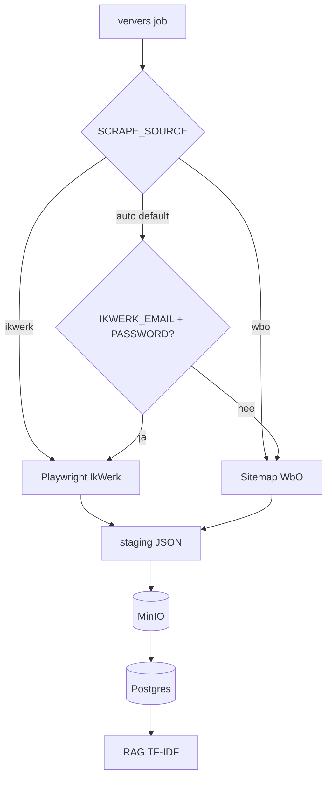

# Architectuur

## Componenten

| Pad | Rol |
|-----|-----|
| `scraper/` | Playwright + WbO sitemap; `ververs_ikwerk.mjs`, `ververs_wbo.mjs` |
| `.cursor/skills/ikwerk-ververs-data/scripts/` | Router (`ververs_data.mjs`), merge, ingest |
| `db/` | Postgres schema, parse, upsert, MinIO client, ingest |
| `rag/` | TF-IDF index, `match_service`, LLM prompts/clients |
| `web/backend/` | FastAPI REST API |
| `web/worker/` | Job poller (scrape, match, LLM) |
| `web/frontend/` | React SPA |

## Dataflow

1. **Ververs** (`run_ververs.sh`): router kiest bron. IkWerk: login + lijst + details. WbO: sitemap op `lastmod` + detail-fetch zonder login. Alleen parameter **sinds** (geen breed/ICT-filter meer).
2. **Upload/ingest**: batches naar MinIO, gestructureerde rijen in Postgres (`db/ingest_run.py`). `filter_set` is `ikwerk` of `wbo`.
3. **Deduplicatie**: `vacancies.slug` is UNIQUE; tweede bron verrijkt dezelfde rij. `vacancy_filters` koppelt bron-label (`ON CONFLICT DO NOTHING`).
4. **RAG rebuild**: worker bouwt TF-IDF-index uit Postgres (`rag/build_index.py`); backup naar MinIO `gold/rag-index/`.
5. **CV-match**: worker rankt vacatures (`rag/match_service.py`); resultaat in `api_jobs`.
6. **LLM**: motivatie/uitleg async; max één LLM-call tegelijk (wachtrij in `api_jobs`).

## Job types

| `job_type` | Worker actie |
|------------|----------------|
| `ververs` | Scrape + ingest + optioneel RAG rebuild |
| `match` | RAG index rebuild |
| `cv_match` | Rank vacatures tegen geüpload CV |
| `llm_motivatie` | Motivatiebrief genereren |
| `llm_explain` | Korte match-uitleg |

## Omgevingsvariabelen

Zie [.env.example](../.env.example). Belangrijk:

- `DATABASE_URL`, `MINIO_*` — data layer
- `SCRAPE_SOURCE` — `auto` (default), `ikwerk`, of `wbo`
- `IKWERK_EMAIL`, `IKWERK_PASSWORD` — alleen voor IkWerk-scrape
- `LLM_PROVIDER`, `OLLAMA_*` of `OPENAI_*` — LLM
- `KEYWORDS_CONFIG` — keyword-scoring
- `API_ADMIN_TOKEN` — beveilig beheer-API

## Bekende beperkingen

- IkWerk-scrape vereist geldige credentials en is afhankelijk van site/reCAPTCHA.
- WbO bij `sinds=all` kan duizenden URLs opleveren (langere run).
- Cloudflare op detailpagina's: Playwright beperkt blokkades; pure HTTP-fetch is onbetrouwbaar.
- Parsing-logica bestaat deels dubbel in `db/parse_vacancy.py` en `rag/vacature_rag.py` (historisch); tests dekken beide paden waar relevant.
